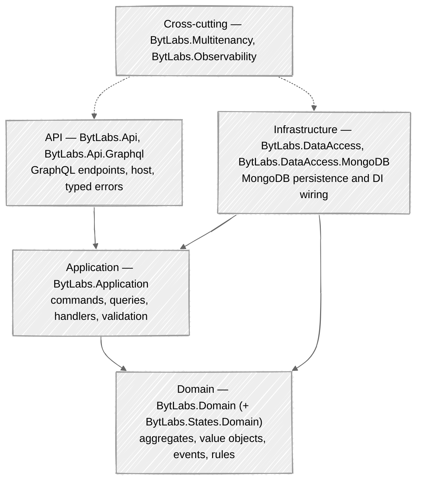

# BytLabs Backend Packages

**A batteries-included foundation for building consistent .NET microservices.**

BytLabs Backend Packages is a curated set of .NET libraries that encode one opinionated, production-ready
way to build a service — Domain-Driven Design, CQRS, MongoDB persistence, multitenancy, GraphQL, and
observability — so every microservice across an organization looks and behaves the same. Wire up a new
service in minutes and spend your time on business logic, not plumbing.

[](https://dotnet.microsoft.com/)
[](https://chillicream.com/docs/hotchocolate)
[](https://www.mongodb.com/)
[](#license)

---

## Why BytLabs?

| Without a shared foundation | With BytLabs |
|---|---|
| Every team wires DDD/CQRS/persistence differently | One consistent architecture across all services |
| Boilerplate for logging, tracing, health, tenancy | Configured in a few fluent calls |
| Inconsistent error handling and API contracts | Standardized GraphQL errors and mutation conventions |
| Hand-rolled MongoDB access and tenant isolation | Generic repository + automatic database-per-tenant |
| Slow, divergent service bootstrap | Start from a working template in minutes |

The result: **uniform architecture, consistent error handling & logging, standardized testing, shared
domain patterns, and common security practices** — onboarding and maintenance get dramatically cheaper.

---

## What you get

- 🎯 **Domain-Driven Design** — aggregates, entities, value objects, domain events, soft-delete, audit, business rules.
- ⚡ **CQRS** — commands/queries on MediatR with automatic FluentValidation and logging pipelines.
- 🗄️ **MongoDB data access** — generic repository, unit-of-work, transactions, and a dynamic-data query engine.
- 🏢 **Multitenancy** — request-scoped tenant resolution with transparent **database-per-tenant** isolation.
- 🚀 **GraphQL API** — HotChocolate with BytLabs defaults: mutation conventions, typed errors, authorization, projections/filtering/sorting.
- 📊 **Observability** — Serilog + OpenTelemetry (logs, metrics, traces) and liveness/readiness/startup health checks.
- 🧩 **Dynamic data** — schema-less JSON fields on aggregates, queryable and filterable through the API.
- 🔁 **State machines** *(optional)* — rule-guarded state transitions for aggregates with a formal lifecycle.

---

## Architecture at a glance

Services built on these packages follow Clean Architecture / DDD with four layers, each mapped to a package:



---

## Package catalog

Full, example-driven docs for each package live in the **[Library Reference](docs/libraries/index.md)**.

### Core
| Package | Description | Docs |
|---|---|---|
| `BytLabs.Domain` | DDD building blocks: `Entity`, `AggregateRootBase`, `ValueObject`, domain events, audit, soft-delete, dynamic data, business rules | [→](docs/libraries/BytLabs.Domain.md) |
| `BytLabs.Application` | CQRS (`ICommand`/`IQuery` + handlers), `IRepository`/`IUnitOfWork`, `DomainEventHandler`, validation + logging pipeline, `AddCQS` | [→](docs/libraries/BytLabs.Application.md) |

### Data access
| Package | Description | Docs |
|---|---|---|
| `BytLabs.DataAccess` | Provider-agnostic unit-of-work, command transactions, domain-event dispatch | [→](docs/libraries/BytLabs.DataAccess.md) |
| `BytLabs.DataAccess.MongoDB` | MongoDB repository, per-tenant database, BSON setup, dynamic-data queries, health checks | [→](docs/libraries/BytLabs.DataAccess.MongoDB.md) |

### API / hosting
| Package | Description | Docs |
|---|---|---|
| `BytLabs.Api` | `ApiServiceBuilder` fluent host (context, tenancy, logging, metrics, tracing, health), config binding | [→](docs/libraries/BytLabs.Api.md) |
| `BytLabs.Api.Graphql` | HotChocolate setup with BytLabs defaults, typed errors, type registration, dynamic-data inputs | [→](docs/libraries/BytLabs.Api.Graphql.md) |

### Cross-cutting & optional
| Package | Description | Docs |
|---|---|---|
| `BytLabs.Multitenancy` | Tenant resolution + database-per-tenant | [→](docs/libraries/BytLabs.Multitenancy.md) |
| `BytLabs.Observability` | Serilog + OpenTelemetry + health checks | [→](docs/libraries/BytLabs.Observability.md) |
| `BytLabs.States.Domain` | State-machine aggregates (RulesEngine) | [→](docs/libraries/BytLabs.States.Domain.md) |
| `BytLabs.Infrastructure` | Shared infrastructure exception (placeholder) | [→](docs/libraries/BytLabs.Infrastructure.md) |

---

## Getting started

### Option A — Start from the template (recommended)

The fastest path is the **BytLabs.MicroserviceTemplate**, a working service that doubles as a
**recipe catalog**: a minimal `Order` aggregate plus an advanced `Product` aggregate demonstrating
every pattern (dynamic data, soft-delete, sub-entities, advanced GraphQL, authorization), each with a
focused how-to doc. Copy it, rename, and build your domain.

### Option B — Add the packages to an existing service

Requirements: **.NET 8 SDK**, **MongoDB ≥ 4.2** (the MongoDB driver is 3.x), and an OpenTelemetry
collector if you want to export telemetry.

Packages are versioned together. With central package management (`Directory.Packages.props`):

```xml
<PropertyGroup>
  <ManagePackageVersionsCentrally>true</ManagePackageVersionsCentrally>
  <BytLabsPackageVersion>4.2.0</BytLabsPackageVersion>
</PropertyGroup>
<ItemGroup>
  <PackageVersion Include="BytLabs.Domain"             Version="$(BytLabsPackageVersion)" />
  <PackageVersion Include="BytLabs.Application"        Version="$(BytLabsPackageVersion)" />
  <PackageVersion Include="BytLabs.DataAccess"         Version="$(BytLabsPackageVersion)" />
  <PackageVersion Include="BytLabs.DataAccess.MongoDB" Version="$(BytLabsPackageVersion)" />
  <PackageVersion Include="BytLabs.Api"               Version="$(BytLabsPackageVersion)" />
  <PackageVersion Include="BytLabs.Api.Graphql"       Version="$(BytLabsPackageVersion)" />
</ItemGroup>
```

## Quick tour

**1. Host (`Program.cs`)** — one fluent chain wires the standard concerns:

```csharp
var builder = WebApplication.CreateBuilder(args);

var app = ApiServiceBuilder.CreateBuilder(builder)
    .WithHttpContextAccessor(uc => uc.AddResolver<HttpUserContextResolver>())
    .WithMultiTenantContext(mt => mt.AddResolver<FromHeaderTenantIdResolver>())
    .WithLogging().WithMetrics().WithTracing().WithHealthChecks()
    .WithServiceConfiguration(services =>
    {
        services.AddInfrastructure(builder.Configuration);   // your DI (below)
        services.AddGraphQLService()
            .AddMongoDbQuerySettings()
            .AddCommandTypes().AddDtoTypes()
            .AddMutationType<Mutation>().AddQueryType<Query>();
    })
    .BuildWebApp(app => { app.UseAuthentication(); app.UseAuthorization(); app.MapGraphQL(); });

app.Run();
```

**2. Infrastructure wiring** — CQS + AutoMapper + per-aggregate repositories:

```csharp
services.AddCQS(new[] { typeof(CreateProductCommand).Assembly });
services.AddAutoMapper(typeof(ProductMappingProfile));
services.AddMongoDatabase(config.GetConfiguration<MongoDatabaseConfiguration>())
    .AddMongoRepository<Product, Guid>();
```

**3. A feature** — aggregate → command → handler:

```csharp
public sealed class Product : AggregateRootBase<Guid>, ISoftDeletable
{
    public string Name { get; private set; }
    public bool IsDeleted { get; private set; }
    private Product(Guid id, string name) : base(id) => Name = name;
    public static Product Create(Guid id, string name)
    {
        var p = new Product(id, name);
        p.AddDomainEvent(new ProductCreated(id, name));
        return p;
    }
}

public record CreateProductCommand(Guid Id, string Name) : ICommand<ProductDto>;

public class CreateProductCommandHandler(IRepository<Product, Guid> repo, IMapper mapper)
    : ICommandHandler<CreateProductCommand, ProductDto>
{
    public async Task<ProductDto> Handle(CreateProductCommand request, CancellationToken ct)
        => mapper.Map<ProductDto>(await repo.InsertAsync(Product.Create(request.Id, request.Name), ct));
}
```

That's a complete, multi-tenant, observable, validated GraphQL mutation. See the
[Library Reference](docs/libraries/index.md) for the full API of each building block.

## Configuration

```jsonc
{
  "ObservabilityConfiguration": {
    "ServiceName": "my-service",
    "CollectorUrl": "http://localhost:4317",
    "Timeout": 1000
  },
  "MongoDatabaseConfiguration": {
    "DatabaseName": "myService",
    "ConnectionString": "mongodb://localhost:27017?retryWrites=false",
    "UseTransactions": false
  }
}
```

> **Multitenancy:** each tenant's data lives in its own database, `"{DatabaseName}-{tenantId}"`,
> resolved per request (e.g. a `Tenant` header). Your domain code needs no tenant field or filter.
> **Transactions:** MongoDB transactions require a replica set — keep `UseTransactions: false` for a
> standalone server.

---

## Documentation

- 📖 **[Library Reference](docs/libraries/index.md)** — per-package guides with usage examples (this repo).
- 🚀 **[Getting Started](docs/getting-started.md)**
- 🌐 Published docs: [docs.bytlabs.co](https://docs.bytlabs.co)
- 🧪 **Recipe catalog** — end-to-end patterns in the BytLabs.MicroserviceTemplate (`docs/recipes/`).

Docs are built with [DocFX](https://dotnet.github.io/docfx/). Build locally:

```bash
docfx docfx.json --serve
```

## Versioning & compatibility

- All BytLabs packages share a single version (`BytLabsPackageVersion`) — upgrade them together.
- Targets **.NET 8**. Requires **MongoDB ≥ 4.2** (MongoDB.Driver 3.x), **HotChocolate 14**.

## Support

- 💬 [Discussions](https://github.com/bytlabs/BytLabs.BackendPackages/discussions)
- 🐛 [Issue Tracker](https://github.com/bytlabs/BytLabs.BackendPackages/issues)

## Contributing

Contributions are welcome. Fork, create a feature branch, and open a pull request. Please keep changes
consistent with the existing architecture and add/update the relevant page under `docs/libraries/`.

## License

Licensed under the MIT License — see [LICENSE](LICENSE).
