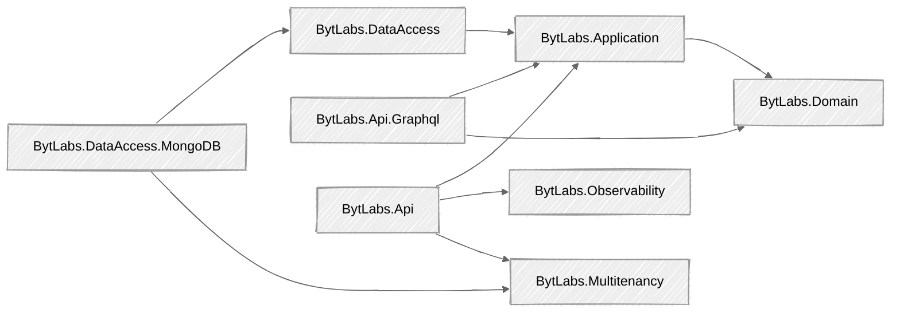

# BytLabs Backend Packages — Reference

Per-package documentation for the BytLabs platform libraries. Each page covers what the package
provides and how to use it, with code examples. Packages are versioned together (one
`BytLabsPackageVersion` in each consumer's `Directory.Packages.props`).

## Packages by layer

### Core (domain & application)
| Package | What it gives you |
|---------|-------------------|
| [BytLabs.Domain](BytLabs.Domain.md) | DDD building blocks: `Entity`, `AggregateRootBase`, `ValueObject`, domain events, audit, soft-delete, dynamic data, business rules |
| [BytLabs.Application](BytLabs.Application.md) | CQRS (`ICommand`/`IQuery` + handlers), `IRepository`/`IUnitOfWork`, `DomainEventHandler`, validation+logging pipeline, user context, `AddCQS` |

### Data access
| Package | What it gives you |
|---------|-------------------|
| [BytLabs.DataAccess](BytLabs.DataAccess.md) | Provider-agnostic unit-of-work, command transactions, domain-event dispatch decorator |
| [BytLabs.DataAccess.MongoDB](BytLabs.DataAccess.MongoDB.md) | MongoDB `IRepository`, per-tenant database, BSON setup, dynamic-data query helpers, health checks |

### API / hosting
| Package | What it gives you |
|---------|-------------------|
| [BytLabs.Api](BytLabs.Api.md) | `ApiServiceBuilder` fluent host (user context, multitenancy, logging, metrics, tracing, health), config binding, HTTP tenant/user resolvers |
| [BytLabs.Api.Graphql](BytLabs.Api.Graphql.md) | HotChocolate setup with BytLabs defaults, typed errors, DTO/command/aggregate type registration, dynamic-data inputs |

### Cross-cutting
| Package | What it gives you |
|---------|-------------------|
| [BytLabs.Multitenancy](BytLabs.Multitenancy.md) | Tenant resolution (`ITenantIdResolver`/`ITenantIdProvider`), database-per-tenant |
| [BytLabs.Observability](BytLabs.Observability.md) | Serilog + OpenTelemetry logging/metrics/tracing and health checks |

### Optional / specialized
| Package | What it gives you |
|---------|-------------------|
| [BytLabs.States.Domain](BytLabs.States.Domain.md) | State-machine aggregates with rule-guarded transitions (RulesEngine) |
| [BytLabs.Infrastructure](BytLabs.Infrastructure.md) | Placeholder; `InfrastructureException` only |

## How they fit together

Arrows point from a package to the packages it depends on.

- A service's **Domain** project references `BytLabs.Domain` (and optionally `BytLabs.States.Domain`).
- **Application** references `BytLabs.Application`.
- **Infrastructure** references `BytLabs.DataAccess.MongoDB` (which pulls in `BytLabs.DataAccess`,
  `BytLabs.Multitenancy`).
- **Api** references `BytLabs.Api` + `BytLabs.Api.Graphql` (which pull in `BytLabs.Observability`,
  `BytLabs.Multitenancy`).

## See also
- A worked, end-to-end example consuming these packages: the **MicroserviceTemplate recipe catalog**
  (`BytLabs.MicroserviceTemplate/docs/recipes/`).
