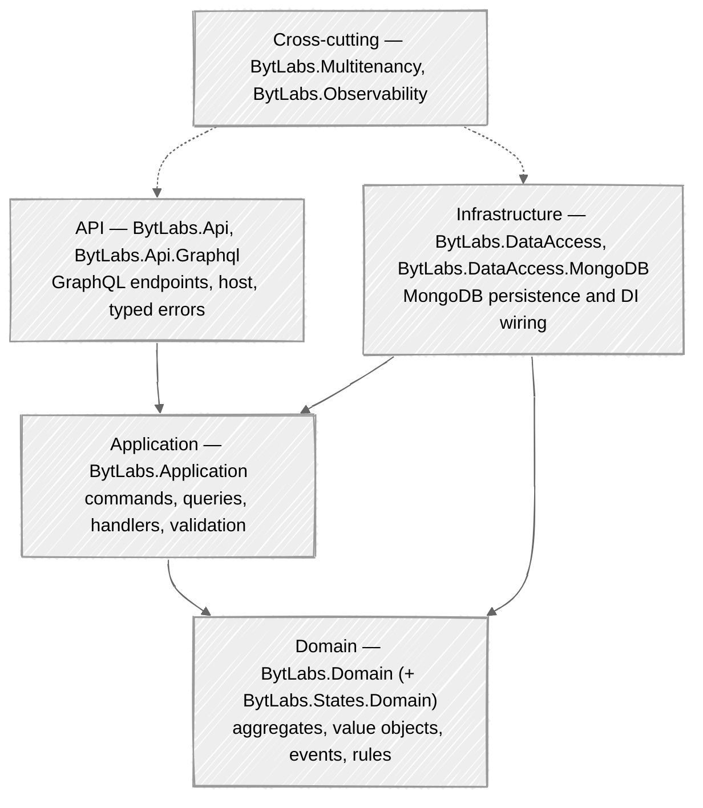
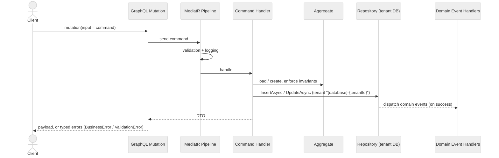
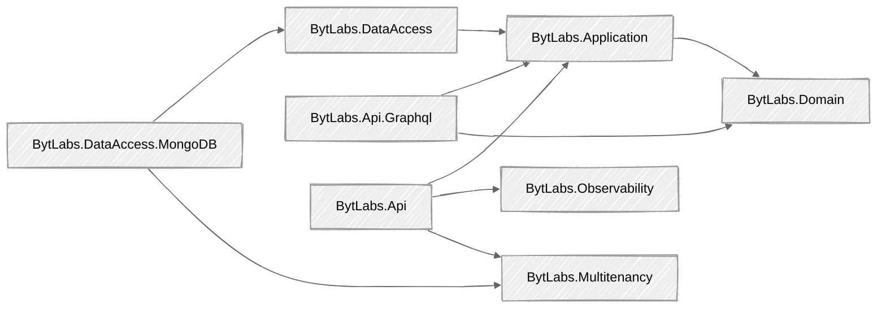

<div align="center">

# BytLabs Backend Packages

**A batteries-included foundation for building consistent .NET microservices.**

A curated set of .NET libraries that encode one opinionated, production-ready way to build a service —
Domain-Driven Design, CQRS, MongoDB persistence, multitenancy, GraphQL, and observability — so every
microservice across your organization looks, behaves, and is operated the same way.

[](https://dotnet.microsoft.com/)
[](https://chillicream.com/docs/hotchocolate)
[](https://www.mongodb.com/)
[](#license)

[Get Started](docs/getting-started.md) &nbsp;·&nbsp; [Library Reference](docs/libraries/index.md) &nbsp;·&nbsp; [Published Docs](https://docs.bytlabs.co)

</div>

<br/>

---

## Overview

Building microservices means solving the same cross-cutting problems over and over: domain modelling,
command/query handling, persistence, tenant isolation, API shape, validation, error handling, logging,
tracing, and health. BytLabs Backend Packages solve them once, consistently, and hand you a clean
surface to build on.

Adopt them and you get a service that is **uniform in architecture, consistent in error handling and
logging, standardized in testing, and aligned on shared domain patterns and security practices** — which
makes onboarding faster and long-term maintenance dramatically cheaper.

<br/>

### Why a shared foundation

| Without a shared foundation | With BytLabs |
|---|---|
| Every team wires DDD / CQRS / persistence differently | One consistent architecture across all services |
| Repetitive boilerplate for logging, tracing, health, tenancy | Configured in a few fluent calls |
| Inconsistent error handling and API contracts | Standardized GraphQL errors and mutation conventions |
| Hand-rolled data access and tenant isolation | Generic repository with automatic database-per-tenant |
| Slow, divergent service bootstrap | Start from a working template in minutes |

<br/>

---

## Capabilities

| Capability | What it provides | Package |
|---|---|---|
| Domain-Driven Design | Aggregates, entities, value objects, domain events, soft-delete, audit, business rules | `BytLabs.Domain` |
| CQRS | Commands and queries on MediatR with automatic FluentValidation and logging pipelines | `BytLabs.Application` |
| Data access | Generic repository, unit-of-work, transactions, and a dynamic-data query engine for MongoDB | `BytLabs.DataAccess`, `BytLabs.DataAccess.MongoDB` |
| Multitenancy | Request-scoped tenant resolution with transparent database-per-tenant isolation | `BytLabs.Multitenancy` |
| GraphQL API | HotChocolate with BytLabs defaults: mutation conventions, typed errors, authorization, projections / filtering / sorting | `BytLabs.Api`, `BytLabs.Api.Graphql` |
| Observability | Serilog and OpenTelemetry logs, metrics, and traces, plus liveness / readiness / startup health checks | `BytLabs.Observability` |
| Dynamic data | Schema-less JSON fields on aggregates, queryable and filterable through the API | `BytLabs.Domain` + data/API packages |
| State machines (optional) | Rule-guarded state transitions for aggregates with a formal lifecycle | `BytLabs.States.Domain` |

<br/>

---

## Architecture

Services built on these packages follow Clean Architecture and DDD with four layers, each mapped to a
package set.



### How a request flows



<br/>

---

## Package catalog

Each package has a focused, example-driven guide in the **[Library Reference](docs/libraries/index.md)**.

### Core

| Package | Description |
|---|---|
| [`BytLabs.Domain`](docs/libraries/BytLabs.Domain.md) | DDD building blocks: `Entity`, `AggregateRootBase`, `ValueObject`, domain events, audit, soft-delete, dynamic data, business rules |
| [`BytLabs.Application`](docs/libraries/BytLabs.Application.md) | CQRS (`ICommand` / `IQuery` and handlers), `IRepository` / `IUnitOfWork`, `DomainEventHandler`, validation and logging pipeline, `AddCQS` |

### Data access

| Package | Description |
|---|---|
| [`BytLabs.DataAccess`](docs/libraries/BytLabs.DataAccess.md) | Provider-agnostic unit-of-work, command transactions, and domain-event dispatch |
| [`BytLabs.DataAccess.MongoDB`](docs/libraries/BytLabs.DataAccess.MongoDB.md) | MongoDB repository, per-tenant database resolution, BSON setup, dynamic-data queries, health checks |

### API and hosting

| Package | Description |
|---|---|
| [`BytLabs.Api`](docs/libraries/BytLabs.Api.md) | `ApiServiceBuilder` fluent host (user context, tenancy, logging, metrics, tracing, health) and configuration binding |
| [`BytLabs.Api.Graphql`](docs/libraries/BytLabs.Api.Graphql.md) | HotChocolate setup with BytLabs defaults, typed errors, type registration helpers, dynamic-data inputs |

### Cross-cutting and optional

| Package | Description |
|---|---|
| [`BytLabs.Multitenancy`](docs/libraries/BytLabs.Multitenancy.md) | Tenant resolution and database-per-tenant isolation |
| [`BytLabs.Observability`](docs/libraries/BytLabs.Observability.md) | Serilog and OpenTelemetry logging, metrics, tracing, and health checks |
| [`BytLabs.States.Domain`](docs/libraries/BytLabs.States.Domain.md) | State-machine aggregates with rule-guarded transitions (RulesEngine) |
| [`BytLabs.Infrastructure`](docs/libraries/BytLabs.Infrastructure.md) | Shared infrastructure exception (reserved for future helpers) |

### Dependency flow

Arrows point from a package to the packages it depends on.



<br/>

---

## Design principles and conventions

- **Domain first.** Business logic lives in aggregates derived from `AggregateRootBase<TId>`. State
  changes go through intent-revealing methods that enforce invariants and raise domain events; entities
  expose private setters and are created via factory methods.
- **CQRS with a pipeline.** Writes are commands; reads are queries or GraphQL projections. Registering
  handlers with `AddCQS` automatically adds FluentValidation and logging behaviors, and (when enabled)
  transactions and domain-event dispatch.
- **Database-per-tenant.** Tenancy is physical and transparent: a tenant id is resolved from the
  request and the matching MongoDB database is selected per request. Domain code carries no tenant
  field and no per-query tenant filter.
- **Dynamic data.** Aggregates may expose a schema-less `JsonElement` payload (`IHaveDynamicData`) that
  is stored natively and is filterable and sortable through the GraphQL API.
- **Consistent error model.** `DomainException` becomes a `BusinessError`; validation failures become a
  `ValidationError` with field details. Both appear in the mutation payload's typed `errors` union.
- **Observability by default.** Structured logging (Serilog), metrics and tracing (OpenTelemetry), and
  liveness / readiness / startup probes are wired by the host builder.

<br/>

---

## Getting started

### Option A — Start from the template (recommended)

The fastest path is the **BytLabs.MicroserviceTemplate**, a working service that doubles as a
**recipe catalog**: a minimal `Order` aggregate plus an advanced `Product` aggregate that demonstrates
every pattern (dynamic data, soft-delete, sub-entities, advanced GraphQL, authorization), each with a
focused how-to page. Copy it, rename it, and start modelling your domain.

### Option B — Add the packages to an existing service

Requirements: **.NET 8 SDK**, **MongoDB 4.2 or newer** (the MongoDB driver is 3.x), and an
OpenTelemetry collector if you intend to export telemetry.

Packages are versioned together. With central package management (`Directory.Packages.props`):

```xml
<PropertyGroup>
  <ManagePackageVersionsCentrally>true</ManagePackageVersionsCentrally>
  <BytLabsPackageVersion>4.2.0</BytLabsPackageVersion>
</PropertyGroup>
<ItemGroup>
  <PackageVersion Include="BytLabs.Domain"             Version="$(BytLabsPackageVersion)" />
  <PackageVersion Include="BytLabs.Application"        Version="$(BytLabsPackageVersion)" />
  <PackageVersion Include="BytLabs.DataAccess"         Version="$(BytLabsPackageVersion)" />
  <PackageVersion Include="BytLabs.DataAccess.MongoDB" Version="$(BytLabsPackageVersion)" />
  <PackageVersion Include="BytLabs.Api"               Version="$(BytLabsPackageVersion)" />
  <PackageVersion Include="BytLabs.Api.Graphql"       Version="$(BytLabsPackageVersion)" />
</ItemGroup>
```

<br/>

---

## Quick tour

**1. Host (`Program.cs`)** — one fluent chain wires the standard concerns:

```csharp
var builder = WebApplication.CreateBuilder(args);

var app = ApiServiceBuilder.CreateBuilder(builder)
    .WithHttpContextAccessor(uc => uc.AddResolver<HttpUserContextResolver>())
    .WithMultiTenantContext(mt => mt.AddResolver<FromHeaderTenantIdResolver>())
    .WithLogging().WithMetrics().WithTracing().WithHealthChecks()
    .WithServiceConfiguration(services =>
    {
        services.AddInfrastructure(builder.Configuration);   // your DI (below)
        services.AddGraphQLService()
            .AddMongoDbQuerySettings()
            .AddCommandTypes().AddDtoTypes()
            .AddMutationType<Mutation>().AddQueryType<Query>();
    })
    .BuildWebApp(app => { app.UseAuthentication(); app.UseAuthorization(); app.MapGraphQL(); });

app.Run();
```

**2. Infrastructure wiring** — CQS, AutoMapper, and per-aggregate repositories:

```csharp
services.AddCQS(new[] { typeof(CreateProductCommand).Assembly });
services.AddAutoMapper(typeof(ProductMappingProfile));
services.AddMongoDatabase(config.GetConfiguration<MongoDatabaseConfiguration>())
    .AddMongoRepository<Product, Guid>();
```

**3. A feature** — aggregate, command, and handler:

```csharp
public sealed class Product : AggregateRootBase<Guid>, ISoftDeletable
{
    public string Name { get; private set; }
    public bool IsDeleted { get; private set; }
    private Product(Guid id, string name) : base(id) => Name = name;
    public static Product Create(Guid id, string name)
    {
        var p = new Product(id, name);
        p.AddDomainEvent(new ProductCreated(id, name));
        return p;
    }
}

public record CreateProductCommand(Guid Id, string Name) : ICommand<ProductDto>;

public class CreateProductCommandHandler(IRepository<Product, Guid> repo, IMapper mapper)
    : ICommandHandler<CreateProductCommand, ProductDto>
{
    public async Task<ProductDto> Handle(CreateProductCommand request, CancellationToken ct)
        => mapper.Map<ProductDto>(await repo.InsertAsync(Product.Create(request.Id, request.Name), ct));
}
```

That is a complete, multi-tenant, observable, validated GraphQL mutation. See the
[Library Reference](docs/libraries/index.md) for the full API of each building block.

<br/>

---

## Configuration

```jsonc
{
  "ObservabilityConfiguration": {
    "ServiceName": "my-service",
    "CollectorUrl": "http://localhost:4317",
    "Timeout": 1000
  },
  "MongoDatabaseConfiguration": {
    "DatabaseName": "myService",
    "ConnectionString": "mongodb://localhost:27017?retryWrites=false",
    "UseTransactions": false
  }
}
```

> **Multitenancy.** Each tenant's data lives in its own database, named `"{DatabaseName}-{tenantId}"`,
> resolved per request (for example from a `Tenant` header). Your domain code needs no tenant field or
> filter.
>
> **Transactions.** MongoDB transactions require a replica set — keep `UseTransactions: false` for a
> standalone server.

<br/>

---

## Testing

Services built on the packages test cleanly at two levels:

- **Unit tests** exercise aggregates and domain logic directly (xUnit + FluentAssertions), with no
  infrastructure.
- **Acceptance tests** boot the API in-process with `WebApplicationFactory` and drive it through the
  generated GraphQL client against a real MongoDB, authenticating via a test scheme and selecting a
  tenant with a header.

The recipe catalog in the BytLabs.MicroserviceTemplate demonstrates both end to end.

<br/>

---

## Versioning and compatibility

- All BytLabs packages share a single version (`BytLabsPackageVersion`) and should be upgraded together.
- Targets **.NET 8**. Requires **MongoDB 4.2 or newer** (MongoDB.Driver 3.x) and **HotChocolate 14**.

<br/>

---

## Documentation

- **[Library Reference](docs/libraries/index.md)** — per-package guides with usage examples.
- **[Getting Started](docs/getting-started.md)** — install, configure, and ship your first feature.
- **Published documentation** at [docs.bytlabs.co](https://docs.bytlabs.co).
- The **recipe catalog** in the BytLabs.MicroserviceTemplate for end-to-end patterns.

Documentation is built with [DocFX](https://dotnet.github.io/docfx/). To preview locally:

```bash
docfx docfx.json --serve
```

<br/>

---

## Support

- [Discussions](https://github.com/bytlabs/BytLabs.BackendPackages/discussions)
- [Issue Tracker](https://github.com/bytlabs/BytLabs.BackendPackages/issues)

## Contributing

Contributions are welcome. Fork the repository, create a feature branch, and open a pull request. Please
keep changes consistent with the existing architecture and update the relevant page under
`docs/libraries/`.

## License

Licensed under the MIT License — see [LICENSE](LICENSE).
